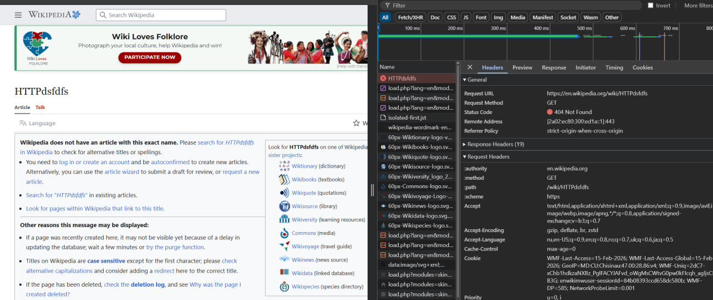
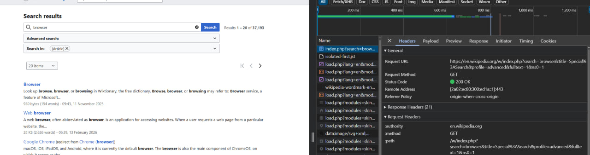
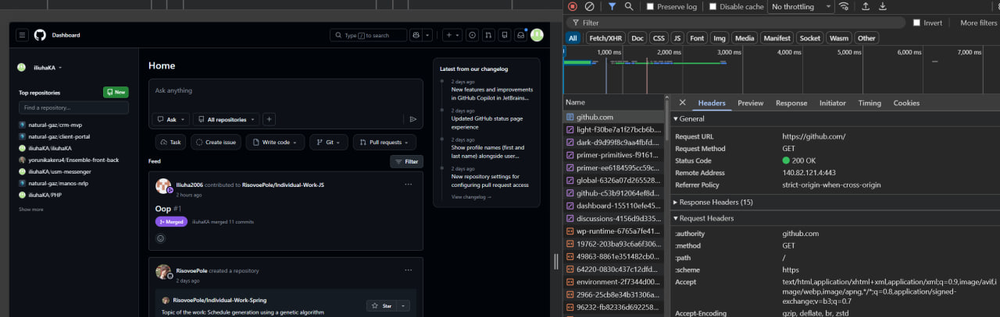

# Лабораторная работа №1. HTTP

## Выполнил - Каралащук Илья IA2403

### Задание 1. Анализ HTTP-запросов. Часть 1

Открыв сайт [https://en.wikipedia.org/wiki/HTTP](https://en.wikipedia.org/wiki/HTTP) в инструментах разработчика первый запрос во вкладке **Network**: \
 \
`GET https://ru.wikipedia.org/wiki/HTTP` 

* URL запроса: `https://ru.wikipedia.org/wiki/HTTP`
* Метод запроса: `GET` 
 
        Метод запроса GET, потому что мы запрашиваем информацию с сервера.
* Статус ответа: `200`

        Диапазон 2xx до 300 означает успешной выполнение действия.

* Заголовки:

    Заголовки **запроса** создержат такие как: 
    - `Accept-Encoding` : список алгоритмов сжати,которые поддерживает клиент. 
    - `Accept-Language`: Список желательных языков с их степенью актуальности для пользователя (праметр `q - quality value`).
    - `Cookie` : Различные данные о пользователи, включая: последнее посещение сайта, относительная геопозиция по IP, id сессии.
    - `User-Agent` : название браузера и устройства.

    ---
    Заголовки **ответа** содержат такие как:
    - `content-encoding` : выбранный тип сжатия
    - `content-type` : тип ответа, с типом кодировки символов.
    - `date` : дата и время, когда сообщение было создано
    - `last-modified` : дата и время того, когда по мнению сервера было сделано последнее изменение. Даная переменная служит резервным механизмом для проверки неизменности ресурса.
    - `server` : описывает программное обеспечение, используемое исходным сервером.

* Тело: 

    Тело **запроса** отсуствует.

    ---

    Тело **ответа** есть, и содержит HTML страницу.

Кроме основного запроса были отправлены множество других запросов типа `GET`, для получение различных данных: скриптов (js), стилей (css), картинок (img), иконок (ico), json объектов.

Открыв сайт [https://en.wikipedia.org/wiki/HTTPdsfdfs](https://en.wikipedia.org/wiki/HTTPdsfdfs) уведил слудеющий результат запроса `GET` : 


* URL запроса: `https://en.wikipedia.org/wiki/HTTPdsfdfs`
* Метод запроса: `GET` 
 
        Метод запроса GET, потому что мы запрашиваем информацию с сервера.
* Статус ответа: `404`

        Диапазон 4xx до 500 означает что запрос клиента содержит ошибку. В данном случае - клиент пытался посететить страницу, которой нету.
* Заголовки:

    Заголовки **запроса** создержат такие как: 
    - `Accept-Encoding` : список алгоритмов сжати,которые поддерживает клиент. 
    - `Accept-Language`: Список желательных языков с их степенью актуальности для пользователя (праметр `q - quality value`).
    - `Cookie` : Различные данные о пользователи, включая: последнее посещение сайта, относительная геопозиция по IP, id сессии.
    - `User-Agent` : название браузера и устройства.

    ---
    Заголовки **ответа** содержат такие как:
    - `content-encoding` : выбранный тип сжатия
    - `content-type` : тип ответа, с типом кодировки символов.
    - `date` : дата и время, когда сообщение было создано
    - `server` : описывает программное обеспечение, используемое исходным сервером.

* Тело: 

    Тело **запроса** отсуствует.

    ---

    Тело **ответа** есть, и содержит HTML страницу.

Дополнительные запросы совпадают по типам с предыдущей страницей: скриптов (js), стилей (css), картинок (img), иконок (ico), json объектов.

### Задание 2.

При поиске по слову `Browser` выполнился следующий http-запрос:
``` http
 GET https://en.wikipedia.org/w/index.php?search=intitle:Browser&title=Special:Search&profile=advanced&fulltext=1&advancedSearch-current={"fields":{"intitle":"Browser"}}&ns0=1 
``` 
 

* URL запроса: `https://en.wikipedia.org/w/index.php`
* Метод запроса: `GET` 
 
        Метод запроса GET, потому что мы запрашиваем информацию с сервера.
* Статус ответа: `200`

        Диапазон 2xx до 300 означает успешной выполнение действия.
* Параметры запроса 
    - search 	`intitle:Browser` - что ищем
    - title `Special:Search` - отображение страницы с результатами
    - profile `advanced` - расширеный поиск
    - fulltext	`1` - флаг для полноценного поиска и внутри страниц
    - advancedSearch-current `{"fields":{"intitle":"Browser"}}` json параметров поиска
    - ns0 `1` - флаг прастранства имён

### Задание 3. 
``` http
GET
	https://github.com/
```



* URL запроса: `https://github.com/`
* Метод запроса: `GET` 
 
        Метод запроса GET, потому что мы запрашиваем информацию с сервера.
* Статус ответа: `200`

        Диапазон 2xx до 300 означает успешной выполнение действия.
* Заголовки:

    Заголовки **запроса** создержат такие как: 
    - `Priority` : приоритет выполнения
    - `Referer`: адрес страницы, с которой был переход на текущую (данный параметр имеет опечатку. правильно "Referrer")
    - `Cookie` : Различные данные о пользователи, включая: последнее посещение сайта, относительная геопозиция по IP, id сессии.
    - `Connection` : определяет повидение сервера. Если значение `keep-alive`, то соединение остаётся и не завершается, позволяя выполнять последующие запросы на тот же сервер.

    ---
    Заголовки **ответа** содержат такие как:
    - `set-cookie` : устанавливает coockies
    - `vary` : определяет, как сопоставить будущие заголовки запроса, чтобы решить, можно ли использовать кешированный ответ, а не запрашивать новый с исходного сервера.
    - `x-content-type-options` : является маркером, используемым сервером для указания того, что типы MIME, объявленные в заголовках Content-Type, должны соблюдаться и не изменяться.
    - `etag` :  является идентификатором специфической версии ресурса. Он позволяет более эффективно использовать кеш и сохраняет пропускную способность, позволяя серверу отправлять не весь ответ, если содержимое не изменилось.

* Тело: 

    Тело **запроса** отсуствует.

    ---

    Тело **ответа** есть, и содержит HTML страницу.

### Задание 4. Составление HTTP-запросов

1. GET-запрос к серверу по адресу http://sandbox.usm.com, в заголовке User-Agent "Caralasciuc Ilia" \
`GET http://sandbox.usm.com User-Agent:"Caralasciuc Ilia"` \
    **User-Agent** используется для определения характеристик системы, операционной системы пользователя.

2. Составьте POST-запрос к серверу по адресу http://sandbox.usm.com/cars, указав в теле запроса следующие параметры: \
    make: марка автомобиля (например, "Toyota") \
    model: модель автомобиля (например, "Corolla") \
    year: год выпуска автомобиля (например, 2020) 

    `POST http://sandbox.usm.com/cars make:"Toyota" model:"Corolla" year:2020`

    **Методы HTTP-запросов:**

    - **GET** для запроса указанного ресурса. 

    - **HEAD** тоже, что и GET, но без тела ответа. Используется для проверки наличия, изьятия метаданных и получения даты последнего изменения.
    - **POST** для передачи данных от клиента серверу. Предполагается, что сервер обработает отправленный ресурс. 
    - **PUT** для преедачи данных от клиента серверу. Предполагает, что ресурс не будет изменён сервером, и в такой же форме будет на указанном URI.
    - **PATCH** Аналогично PUT, но применяется только к фрагменту ресурса. 
    - **DELETE** удаляет указанный ресурс.
    - **TRACE** Возвращает полученный запрос так, что клиент может увидеть, какую информацию промежуточные серверы добавляют или изменяют в запросе. 
    - **CONNECT** преобразует соединение запроса в прозрачный TCP/IP-туннель.

3. Составьте PUT-запрос к серверу по адресу http://sandbox.usm.com/cars/1, указав в заголовке User-Agent ваше имя и фамилию, в заголовке Content-Type значение application/json и в теле запроса следующие параметры:

    ``` json
    {
    "make": "Toyota",
    "model": "Corolla",
    "year": 2021
    }
    ```

    ``` http
    PUT http://sandbox.usm.com/cars/1 User-Agent:"Ilia Caralasciuc" Content-Type:application/json 
    make = Toyota
    model = Corolla
    year := 2021
    ``` 

    Разница между POST и PUT в том, что с при выполнении POST ресурс значит "добавить", а PUT "поставить" или "заменить".

4. Напишите один из возможных вариантов ответа сервера следующий запрос: 

    ``` http
    POST /cars HTTP/1.1
    Host: sandbox.com
    Content-Type: application/json
    User-Agent: John Doe
    model=Corolla&make=Toyota&year=2020
    ```

    Возможный ответ:
    ``` http
    HTTP/1.1 200 OK
    Host: sandbox.com
    Content-Type: image/png
    Content-Length: 12345
    ```

    Возможные ситуации для кодов:
    - 200 - картинка успешно отправилась 
    - 201 - запись создана.
    - 400 - ошибка в запросе (не верный запрос). 
    - 401 - ошибка авторизации - клиент не авторизован.
    - 403 - нет прав доступа (запрещено)
    - 404 - не найдено. Подключние к серверу есть, но не получилось найти запрашиваемый ресурс.
    - 500 - общий код внутренней ошибки сервера. 
