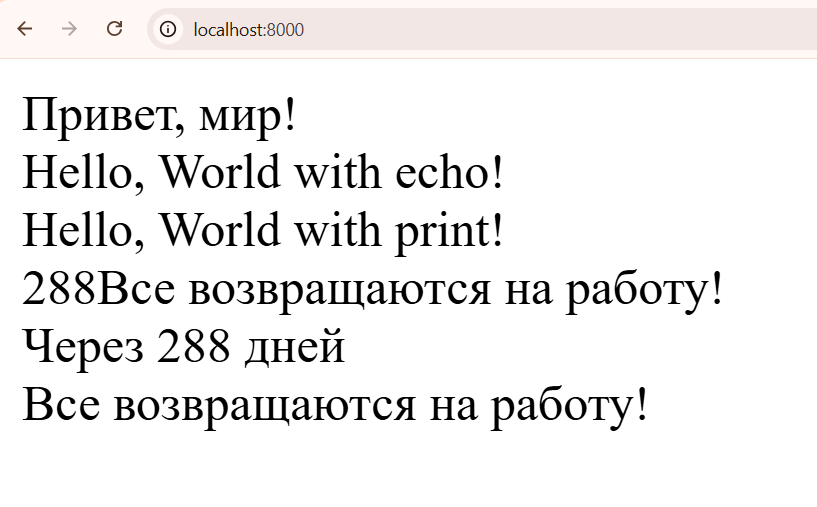

# Лабораторная работа №2. Установка и первая программа на PHP

## Инструкции по запуску проекта

### Предварительные требования
- Установленный PHP (у меня версия 8.5.3)
- Браузер, в котором будет проверять localhost:8000

### Способы запуска

#### 1. Использование встроенного веб-сервера PHP
```bash
# Перейдите в директорию проекта
cd "d:\Delevopment Workspace\Workflow\University\PHP\Lab_2"

# Запустите встроенный сервер PHP
php -S localhost:8000
```

Откройте браузер и перейдите по адресу: `http://localhost:8000`

#### 2. Запуск через командную строку
```bash
php index.php
```

#### 3. Использование XAMPP (альтернатива)
- Скопируйте папку проекта в `C:\xampp\htdocs\`
- Запустите Apache через XAMPP Control Panel
- Откройте в браузере: `http://localhost/Lab_2/`

---

## Описание лабораторной работы

### Цель работы
Целью данной лабораторной работы является установка и настройка среды разработки для работы с языком программирования PHP, а также создание первой программы на PHP.

### Задачи
1. **Установка PHP** - установка интерпретатора PHP на рабочую станцию
2. **Написание первой программы** - создание базового скрипта "Hello, World!"
3. **Вывод данных** - использование функций `echo` и `print`
4. **Работа с переменными** - создание и вывод переменных разных типов
5. **Форматирование вывода** - использование конкатенации и интерполяции строк

---

## Краткая документация к проекту

### Структура проекта
```
Lab_2/
├── index.php           # Основной файл с PHP-кодом
├── images/             # Папка с изображениями
│   └── lab1_works.png  # Скриншот работы проекта
└── README.md           # Документация проекта
```

### Основные компоненты

#### index.php
Содержит выполнение всех заданий лабораторной работы:
- Вывод приветственного сообщения
- Демонстрация работы `echo` и `print`
- Работа с переменными
- Различные способы форматирования вывода

---

## Примеры использования проекта

### Шаг 1: Установка PHP

Для установки PHP я выбрал **установка вручную** (первый вариант):

1. Загружена актуальная версия PHP (8.5.3) с официального сайта: https://www.php.net/downloads
2. Архив распакован в директорию `C:\Program Files\php`
3. Путь к PHP добавлен в переменные среды PATH
4. Проверка установки:

```bash
php -v
```

Результат проверки:
```
PHP 8.x.x (cli) (built: ...)
Copyright (c) The PHP Group
Zend Engine v4.x.x
```

### Шаг 2: Написание первой PHP-программы

Создан файл [index.php](index.php) со следующим содержимым:

```php
<?php

echo "Привет, мир! <br/>";
```

### Шаг 3: Вывод данных в PHP

Реализованы оба способа вывода:

```php
<?php

echo "Hello, World with echo! <br/>";
print "Hello, World with print! <br/>";
```

**Результат:**
```
Hello, World with echo!
Hello, World with print!
```

### Шаг 4: Работа с переменными и выводом

Созданы переменные и реализованы различные способы вывода:

```php
<?php

$days = 288;
$message = "Все возвращаются на работу! <br/> ";

// Способ 1: Конкатенация
echo $days . $message;

// Способ 2: Интерполяция (двойные кавычки)
echo "Через $days дней <br/> $message";
```

**Результат:**
```
288Все возвращаются на работу!
Через 288 дней
Все возвращаются на работу!
```

### Скриншот работы проекта



### Полный код проекта

```php
<?php

echo "Привет, мир! <br/>";

echo "Hello, World with echo! <br/>";
print "Hello, World with print! <br/>";

$days = 288;
$message = "Все возвращаются на работу! <br/> ";

echo $days . $message;
echo "Через $days дней <br/> $message";

?>
```

---

## Ответы на контрольные вопросы

### 1. Какие способы установки PHP существуют?

Существует несколько способов установки PHP:

**а) Ручная установка:**
- Скачивание дистрибутива с официального сайта php.net
- Распаковка в системную директорию
- Настройка переменных окружения PATH
- Конфигурирование php.ini

**б) Использование готовых пакетов (XAMPP, WAMP, MAMP):**
- XAMPP - кроссплатформенный пакет (Apache + MySQL + PHP + Perl)
- WAMP - для Windows (Windows + Apache + MySQL + PHP)
- MAMP - для macOS (Mac + Apache + MySQL + PHP)
- Включает веб-сервер, базу данных и PHP

**в) Использование менеджеров пакетов:**
- Windows: Chocolatey (`choco install php`)
- Linux: apt, yum, dnf (`sudo apt install php`)
- macOS: Homebrew (`brew install php`)

**г) Использование Docker:**
- Запуск PHP в контейнере
- Изолированная среда разработки

### 2. Как проверить, что PHP установлен и работает?

Существует несколько способов проверки:

**а) Проверка через командную строку:**
```bash
php -v
```
Выводит версию PHP и информацию о сборке.

**б) Проверка через веб-сервер:**
Создать файл `phpinfo.php` с содержимым:
```php
<?php
phpinfo();
?>
```
Открыть его в браузере - будет показана полная информация о конфигурации PHP.

**в) Запуск тестового скрипта:**
```bash
php -r "echo 'PHP работает!';"
```

**г) Проверка встроенного веб-сервера:**
```bash
php -S localhost:8000
```
Если сервер запустился - PHP работает корректно.

### 3. Чем отличается оператор echo от print?

 - print - возвращает значение, а echo - нет.
 - echo - может иметь несколько аргументов, а print - нет.

**Примеры различий:**

```php
// echo с несколькими аргументами
echo "Hello", " ", "World!"; // OK

// print с несколькими аргументами
print "Hello", " ", "World!"; // ОШИБКА!

// print в выражении
$result = print "Hello"; // $result = 1

// echo в выражении
$result = echo "Hello"; // ОШИБКА!
```

---

## Список использованных источников

1. **Официальный сайт PHP** - https://www.php.net/downloads
   Загрузка дистрибутива PHP

2. **PHP Manual** - https://www.php.net/manual/ru/
   Официальная документация по языку PHP

3. **Указания к лабораторной работе №2** - https://elearning.usm.md/mod/assign/view.php?id=327108
   "Установка и первая программа на PHP"

4. **Какие способы установки PHP существуют?** - https://sky.pro/wiki/html/ustanovka-php-na-razlichnyh-os/

---


**Дата выполнения:** 17.02.2026
**Выполнил:** [Каралащук Илья]
**Группа:** [IA2403ru]
