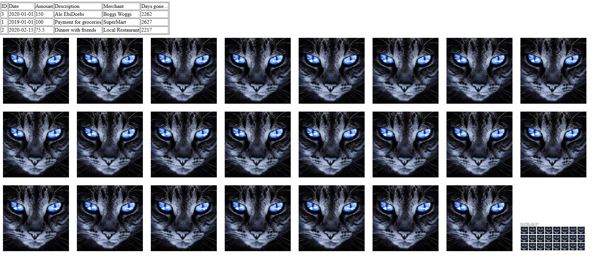

# Лабораторная работа №4: Массивы и Функции


## Инструкции по запуску
1. Перейдите в папку `Lab_4` и запустите встроенный сервер:
   ```bash
   cd "d:/Delevopment Workspace/Workflow/University/PHP/Lab_4"
   php -S localhost:8000
   ```
2. Откройте в браузере localhost:8000 — таблица транзакций и галерея изображений будут отображены автоматически.

## Описание лабораторной работы
### Цель
Освоить работу с массивами: создание, добавление, удаление, сортировка, поиск. Практиковаться в написании функций, передаче аргументов, возврате значений и использовании анонимных функций.

### Задачи
- Подготовить среду (файл `index.php`, строгая типизация).
- Сформировать массив `$transactions` с полями `id`, `date`, `amount`, `description`, `merchant`.
- Вывести массив в HTML‑таблице.
- Реализовать функции для вычислений и поиска (см. раздел «Документация»).
- Добавить столбец «дни с момента транзакции».
- Добавить функцию добавления транзакций и продемонстрировать её использование.
- Выполнить сортировки массива по дате и сумме с помощью `usort()`.
- Перебрать содержимое директории `image` и показать картинки на странице.

## Краткая документация проекта
Функции, используемые в `index.php`:

```php
/**
 * Calculate the total amount of all transactions.
 */
function calculateTotalAmount(array $transactions): float { ... }

/**
 * Search transactions by description substring.
 */
function findTransactionByDescription(string $descriptionPart) { ... }

/**
 * Find transaction by ID using foreach.
 */
function findTransactionById(int $id) { ... }

/**
 * Filter transactions by ID (array_filter).
 */
function findTransactionByIdHigh(int $id) { ... }

/**
 * Days elapsed since a given date.
 */
function daysSinceTransaction(string $date): int { ... }

/**
 * Append a new transaction to the list (by reference).
 */
function addTransaction(array &$trs, int $id, string $date, float $amount, string $description, string $merchant): void { ... }
```

В `index.php` также определены вызовы `usort()` для сортировки и цикл `scandir()` для галереи.

## Примеры использования
**Вывод таблицы транзакций (фрагмент):**

```php
<table border="1">
<thead>
    <tr><td>ID</td><td>Date</td><td>Amount</td><td>Description</td><td>Merchant</td><td>Days gone...</td></tr>
</thead>
<tbody>
<?php foreach ($transactions as $t): ?>
<tr>
    <td><?= $t['id'] ?></td>
    <td><?= $t['date'] ?></td>
    <td><?= $t['amount'] ?></td>
    <td><?= $t['description'] ?></td>
    <td><?= $t['merchant'] ?></td>
    <td><?= daysSinceTransaction($t['date']) ?></td>
</tr>
<?php endforeach; ?>
</tbody>
</table>
```

*Скриншот вывода:*


**Галерея изображений:**
```php
$files = scandir('image/');
foreach ($files as $file) {
    if ($file === '.' || $file === '..') continue;
    echo '';
}
```

## Ответы на контрольные вопросы
1. **Что такое массивы в PHP?**
   Упорядоченные коллекции значений с числовыми или строковыми ключами.
2. **Как создать массив?**
   Использовать `[]` или `array()`, например `$a = [1,2,3];`.
3. **Для чего нужен `foreach`?**
   Для перебора элементов массива/объекта без учета индексов.

## Список использованных источников
- Официальная документация PHP: https://www.php.net/manual/
- Класс `DateTime` и метод `diff`: https://www.php.net/datetime